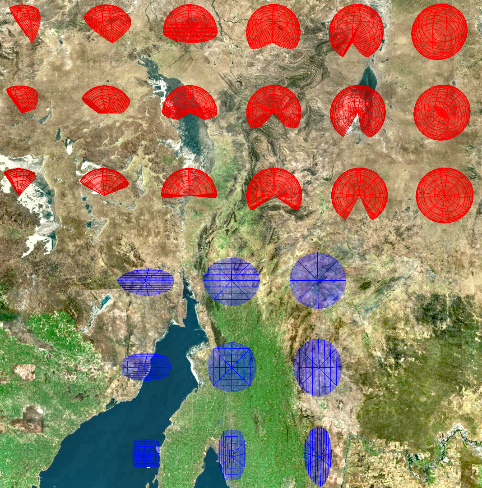
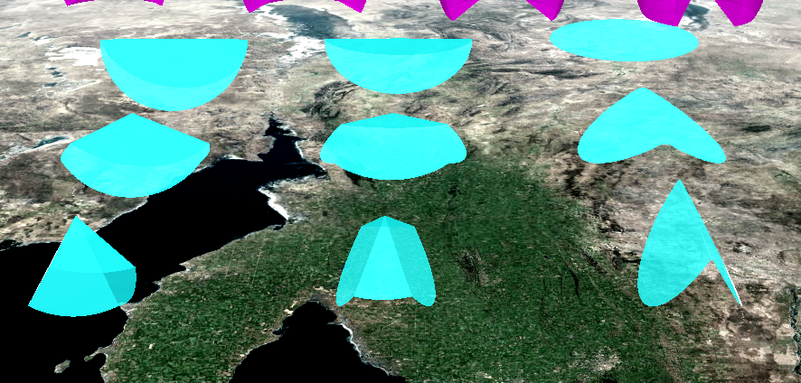
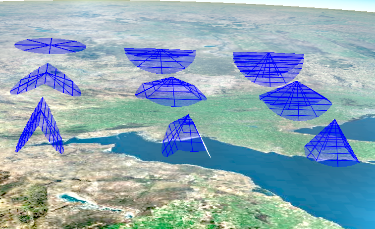
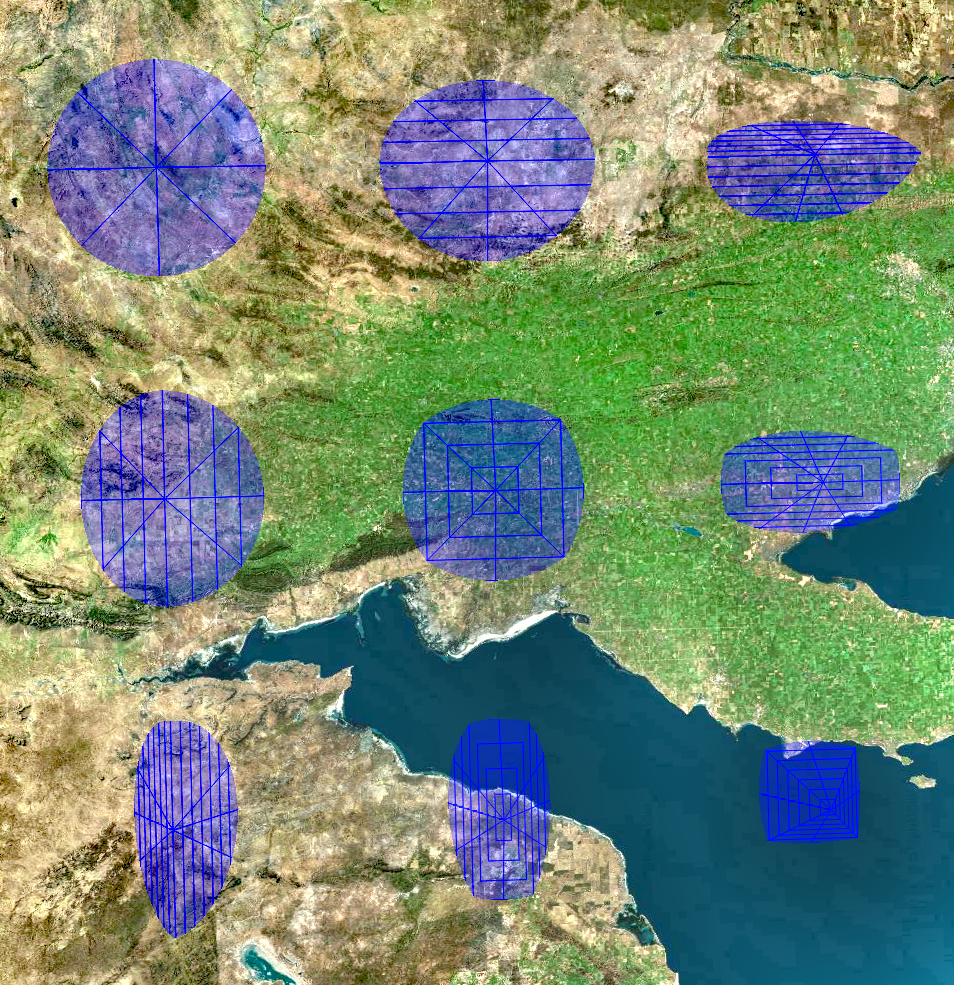
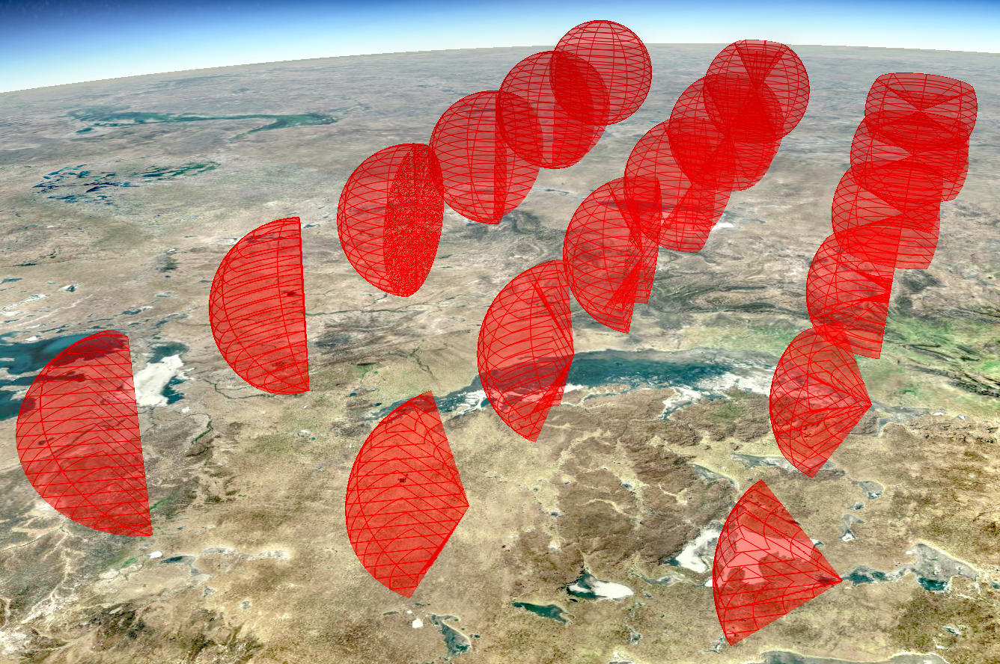
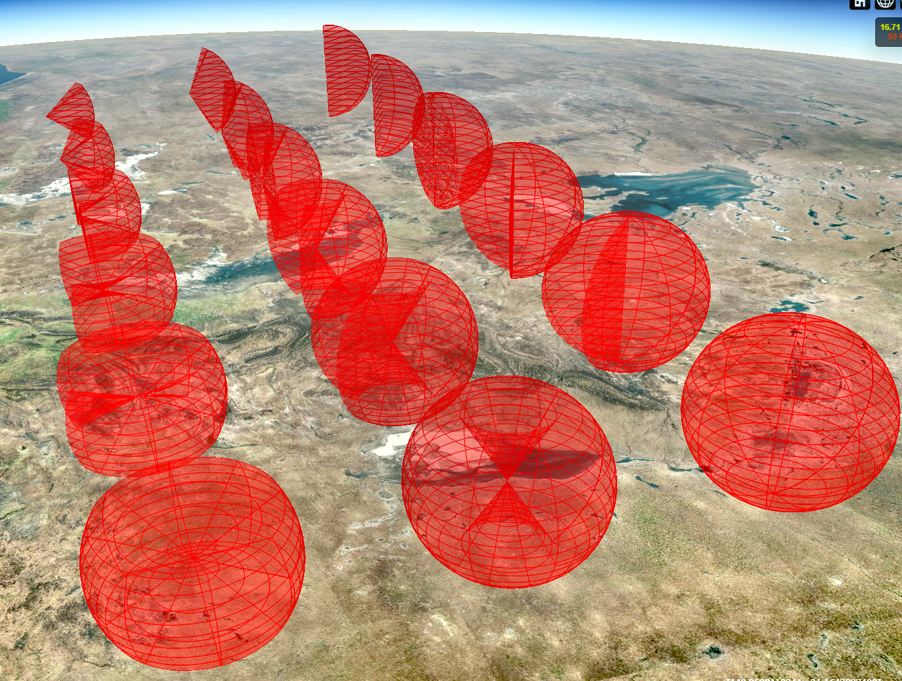
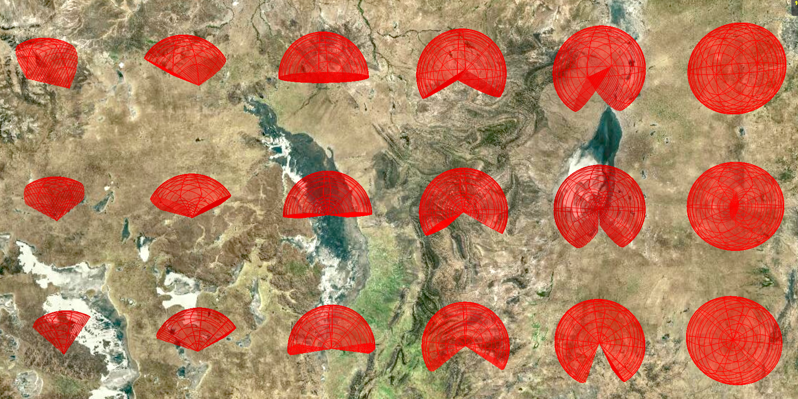

# [cesium](https://cesiumjs.org)-sensor-volumes
[](http://www.apache.org/licenses/LICENSE-2.0.html)

A Cesium plugin for visualizing sensor volumes. Based on [cesium-sensors](https://github.com/AnalyticalGraphicsInc/cesium-sensors) and evolved to support more recent Cesium versions.
Note this fork (stewienj fork has a few additions to it, including a new Torus like sensor, which is documented below.

## Install

This version isn't installable from npm as it is a customized version.

## Usage

Prebuilt minified and unminified versions of the plugin are in the [dist](dist/) directory.  Include the `cesium-sensor-volumes.js` file using a `script` tag after the `Cesium.js` `script` tag.

The plugin automatically adds support for the CZML properties `agi_conicSensor`, `agi_customPatternSensor`, `agi_rectangularSensor`, and a new `agi_torusSensor`.  The corresponding `Entity` properties are `conicSensor`, `customPatternSensor`, `rectangularSensor` and `torusSensor`.

In order to load data directly into `Entity` objects that you create directly, you must call `entity.addProperty` to create each of the sensor properties you wish to use.  The CZML processing does this automatically.

```html
<script src="path/to/Cesium.js"></script>
<script src="path/to/cesium-sensor-volumes.js"></script>
<script>
// To create an entity directly
var entityCollection = new Cesium.EntityCollection();

var entity = entityCollection.getOrCreateEntity('test');
entity.addProperty('conicSensor');

// configure other entity properties, e.g. position and orientation...

entity.conicSensor = new CesiumSensorVolumes.ConicSensorGraphics();
entity.conicSensor.intersectionColor = new Cesium.ConstantProperty(new Cesium.Color(0.1, 0.2, 0.3, 0.4));
</script>
```

### Examples

Simple examples are included in the [examples](examples/) folder.  To run locally, run `npm start` and navigate to [http://localhost:3000](http://localhost:3000) and select the example application to run.

Here are some screen shots of the sample that shows off some different configurations. The blue sensors are the rectangular sensor, and the red sensors are the new torus sensor (new in stewienj fork).















## Build

Building requires you use NodeJS version 10, had problems with later versions, and all the line endings must be LF, not CRLF

To build, run `npm install`, then run `npm run build`.

## License

Apache 2.0.  Free for commercial and non-commercial use.  See [LICENSE.md](LICENSE.md).
